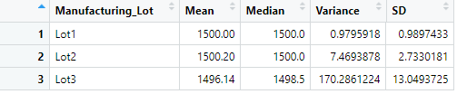
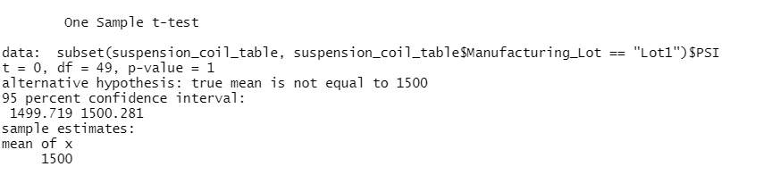

# MechaCar Statistical Analysis

## Linear Regression to Predict MPG

We ran a linear regression using R on the ```MechaCar_mpg.csv``` file to check the correlation that all factors such as: vehicle length, weight, spoiler angle and whether the vehicle is an AWD had on the mileage of the car. We found the following coefficients:


We performed a statistical summary as well, that threw out the following results:


Thanks to these two pieces of analysis data, we can obtain certain conclusions: As seen by the numbers in the ```Pr(>|t|)``` column (a lower number represents higher significance), **vehicle length, weight and ground clearance** have the coefficients with the greatest impact on mileage, it being a *positive* relationship. 

Due to the significance of our coefficients, we can confidently say that the slopes generated by our linear model are non-zero for the most impactful coefficients. 

The fact that our intercept is *significantly non-zero*, means that there are some other factors at play that may contribute to the mileage. However, our R-squared value indicates that our model predicts mileage for about 71% of our data points. Which means it is a very effective model, though it may be improved with more data points.

## Summary Statistics on Suspension Coils

The following are the summary of results when analyzing the manufacturing data of MechaCar's vehicles in regard to their suspension coils.

### Overall Summary


### Summary by Lot



The Design specifications for the MechaCar's suspension coils dictate that the variance of the suspension coils must not exceed 100 PSI. Our analysis found that accross all lots, the suspension coils **do** follow this guideline, with a variance of *62.29*. However, when analyzing the data of each individual lot, we discovered that the suspension coils at Lot 3 **do not** follow this guideline, with a variance of *170.28*. It is recommended that the vehicles in Lot 3 be inspected so the vehicles comply with the guidelines.

## T-Tests on Suspension Coils

It was also part of the analysis to determine whether or not the PSI for suspension coils accross all manufacturing, as well as each individual lot is statistically different from the industry mean of 1500 PSI. For which we decided to do a t-test on the total mean as well as the means of each individual lot. We chose a p-value of **p = 0.05** to reject our null hypothesis that the true mean is not equal to 1500 psi.

The overall results showed that accross all manufacturing, we got a p-value of **0.06**, being greater than our established p-value, we fail to reject the null hypothesis. Therefore, accross all manufacturing, the mean is not statistically different.


For each individual Lot, we find that lots 1 and 2, with p-values of **1.00** and **0.61** respectively, this is strong evidence to declate that the mean is not statistically different.

### Lot 1 t-test result



### Lot 2 t-test result


However, when it comes to lot 3, we obtained a p-value of **0.04** which is statistically significant enough to reject our null hypothesis. We can therefore conclude that the cars available on lot 3 have a statistically different mean than that of the industry. This may be correlated with the increased variance, which may suggest some outlier vehicles. In any case, an inspection of vehicles is strongly recommended.

### Lot 3 t-test result


## Study Design: MechaCar vs Competition

We wish to outline a study to quantify how is MechaCar performing against the competition. There may be several factors at play when assessing a company's products' performance on a shared industry.

Among the factors we wish to gather data from are: cost, mileage, maintenance cost and safety rating. We want to individually compare these metrics to those purposed by the competition to assess and define our idea of quality. As an example, one of the metrics that we believe are most important to test will be our **mileage**

Our **null hypothesis** will consist of us comparing the means of each metric against that of the competition. That is, we look that *there is no statistical difference between our mean average mileage and that of the competition*. As a consequence, our **alternative hypothersis** would be that *there **is** a statistical difference between our mean average mileage and that of the competition*.

The best test to compare the metrics between us and the competition will be a **two-sample t-test** as we are looking for a *statistical difference* between two obseved sample means. For this test, we will need the **vehicle information** regarding mpg, cost, maintenance cost and safety ratings for each vehicle and compare then with samples gathered with publicly available information about the competition.

These tests may be capable of giving us a perceivable advantage over our competitors so that the public is more aware of our products and we are capable of standing out in an increasingly competitive market.

